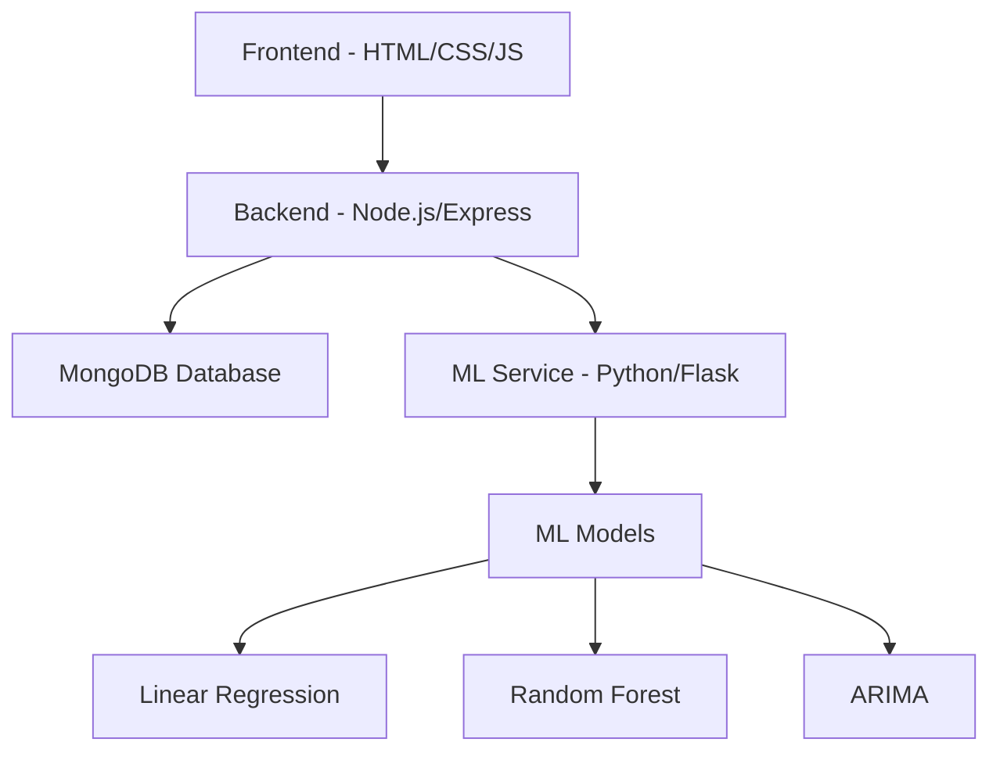

# 📊 Intelligent Demand Forecast & Inventory Management System

A production-ready, AI-powered demand forecasting and inventory management platform that helps businesses make data-driven decisions through advanced machine learning models and real-time analytics.


## 🌟 Features

### 🤖 AI-Powered Forecasting
- **Multi-Model Approach**: Linear Regression, Random Forest, and ARIMA
- **Automatic Model Selection**: Chooses the best model based on accuracy metrics
- **Confidence Intervals**: Min/max demand predictions for risk assessment
- **Seasonality Detection**: Identifies seasonal patterns in sales data
- **Trend Analysis**: Detects increasing, decreasing, or stable trends
- **Anomaly Detection**: Flags unusual sales spikes or drops

### 📈 Business Intelligence
- **Real-Time Dashboard**: KPI cards with total products, sales, predicted demand, and forecast accuracy
- **Interactive Charts**: Zoom, filter, and explore data with Chart.js visualizations
- **Model Comparison**: Side-by-side comparison of RMSE, MAE, R², and MAPE metrics
- **Multi-Product & Multi-Store**: Support for complex business structures

### 📦 Inventory Management
- **Smart Alerts**: Low stock, overstock, and reorder notifications
- **Severity Levels**: High, medium, and low priority alerts
- **Reorder Recommendations**: Suggested quantities and timing
- **Risk Indicators**: Stock-out and excess inventory warnings

### 📊 Data Management
- **File Upload**: CSV and Excel support with drag-and-drop
- **Manual Entry**: Quick data entry for individual records
- **Data Validation**: Automatic error checking and feedback
- **Bulk Operations**: Upload hundreds of records at once

### 📄 Reports & Export
- **CSV Export**: Download forecasts and inventory data
- **PDF Reports**: Professional formatted reports with charts
- **Summary Statistics**: Quick overview of key metrics
- **Customizable Filters**: Export specific products, stores, or date ranges

### 🎨 Modern UI/UX
- **Dark Mode**: Toggle between light and dark themes
- **Responsive Design**: Works on desktop, tablet, and mobile
- **Professional Aesthetics**: Modern gradients, animations, and card layouts
- **Role-Based Access**: Admin and user roles with different permissions

## 🏗️ Architecture



### Technology Stack

**Frontend**
- HTML5, CSS3, JavaScript (ES6+)
- Chart.js for visualizations
- Responsive grid system
- Dark mode support

**Backend**
- Node.js with Express.js
- MongoDB with Mongoose ODM
- JWT authentication
- Multer for file uploads
- PDFKit for PDF generation

**ML Service**
- Python 3.8+
- Flask web framework
- scikit-learn for ML models
- statsmodels for ARIMA
- pandas & numpy for data processing

## 📁 Project Structure

```
demand-forecast-system/
├── frontend/
│   ├── index.html (login)
│   ├── signup.html
│   ├── dashboard.html
│   ├── data-upload.html
│   ├── forecasting.html
│   ├── inventory.html
│   ├── reports.html
│   ├── css/
│   │   └── styles.css
│   └── js/
│       ├── auth.js
│       ├── dashboard.js
│       ├── data-upload.js
│       ├── forecasting.js
│       ├── inventory.js
│       └── utils.js
├── backend/
│   ├── server.js
│   ├── config/
│   ├── models/
│   ├── routes/
│   ├── middleware/
│   └── package.json
├── ml-service/
│   ├── app.py
│   ├── models/
│   ├── preprocessing/
│   ├── utils/
│   └── requirements.txt
├── .env
└── README.md
```

## 🚀 Setup Instructions

### Prerequisites

- Node.js (v14 or higher)
- Python 3.8+
- MongoDB (local or Atlas)
- npm or yarn

### 1. Clone the Repository

```bash
cd demand-forecast-system
```

### 2. Backend Setup

```bash
cd backend
npm install
```

Configure `.env` file in the root directory:
```env
MONGODB_URI=mongodb://localhost:27017/demand-forecast-db
JWT_SECRET=your-secret-key
BACKEND_PORT=5000
ML_SERVICE_PORT=5001
ML_SERVICE_URL=http://localhost:5001
FRONTEND_URL=http://localhost:3000
```

### 3. ML Service Setup

```bash
cd ml-service
pip install -r requirements.txt
```

### 4. MongoDB Setup

Start MongoDB locally:
```bash
mongod
```

Or use MongoDB Atlas (cloud):
- Create a free cluster at [mongodb.com/atlas](https://www.mongodb.com/atlas)
- Update `MONGODB_URI` in `.env`

### 5. Run the Application

**Terminal 1 - Backend:**
```bash
cd backend
npm start
```

**Terminal 2 - ML Service:**
```bash
cd ml-service
python app.py
```

**Terminal 3 - Frontend:**
```bash
cd frontend
# Use a simple HTTP server
python -m http.server 3000
# Or use Node.js http-server
npx http-server -p 3000
```

### 6. Access the Application

Open your browser and navigate to:
```
http://localhost:3000
```

## 📖 Usage Guide

### 1. Create an Account

- Navigate to the signup page
- Choose "Admin" or "User" role
- Complete registration

### 2. Upload Sales Data

- Go to **Data** page
- Upload CSV/Excel file or enter data manually
- CSV format: `productId, storeId, date, quantity, revenue`

### 3. Generate Forecasts

- Navigate to **Forecasting** page
- Enter Product ID and Store ID
- Select forecast period (7-90 days)
- Choose model or use "Auto" for best selection
- Click "Generate Forecast"

### 4. View Inventory Alerts

- Go to **Inventory** page
- Click "Generate Alerts" to create new alerts
- Filter by type, severity, or status
- Review recommendations

### 5. Export Reports

- Navigate to **Reports** page
- Select forecast or inventory report
- Download as CSV or PDF

## 🔑 API Endpoints

### Authentication
- `POST /api/auth/signup` - Register new user
- `POST /api/auth/login` - Login user
- `GET /api/auth/me` - Get current user

### Products
- `GET /api/products` - List products
- `POST /api/products` - Create product (Admin)
- `PUT /api/products/:id` - Update product
- `DELETE /api/products/:id` - Delete product (Admin)

### Sales Data
- `POST /api/sales/upload` - Upload CSV/Excel
- `POST /api/sales/manual` - Add manual entry
- `GET /api/sales` - Get sales data
- `DELETE /api/sales/:id` - Delete record

### Forecasts
- `POST /api/forecasts/generate` - Generate forecast
- `GET /api/forecasts` - Get forecasts
- `GET /api/forecasts/comparison` - Model comparison

### Alerts
- `POST /api/alerts/generate` - Generate alerts
- `GET /api/alerts` - Get alerts
- `PUT /api/alerts/:id/read` - Mark as read

### Reports
- `GET /api/reports/forecast/csv` - Export forecast CSV
- `GET /api/reports/forecast/pdf` - Export forecast PDF
- `GET /api/reports/inventory/csv` - Export inventory CSV
- `GET /api/reports/summary` - Get summary stats

## 🧪 Sample Data

Create a CSV file with this format:

```csv
productId,storeId,date,quantity,revenue
PROD001,STORE001,2024-01-01,150,1500
PROD001,STORE001,2024-01-02,165,1650
PROD001,STORE001,2024-01-03,142,1420
PROD002,STORE001,2024-01-01,200,2000
PROD002,STORE001,2024-01-02,210,2100
```

## 🎯 Key Metrics

- **RMSE** (Root Mean Square Error): Lower is better
- **MAE** (Mean Absolute Error): Average prediction error
- **R²** (R-squared): Model fit quality (0-1, higher is better)
- **MAPE** (Mean Absolute Percentage Error): Percentage error

## 🔒 Security Features

- JWT-based authentication
- Password hashing with bcrypt
- Role-based access control
- Input validation and sanitization
- CORS protection
- Secure HTTP headers

## 🚢 Deployment

### Docker Deployment (Recommended)

Create `docker-compose.yml`:

```yaml
version: '3.8'
services:
  mongodb:
    image: mongo:latest
    ports:
      - "27017:27017"
  
  backend:
    build: ./backend
    ports:
      - "5000:5000"
    depends_on:
      - mongodb
  
  ml-service:
    build: ./ml-service
    ports:
      - "5001:5001"
  
  frontend:
    build: ./frontend
    ports:
      - "3000:3000"
```

Run:
```bash
docker-compose up
```

## 📝 Future Enhancements

- [ ] LSTM model integration
- [ ] Real-time WebSocket updates
- [ ] Email notifications for alerts
- [ ] Multi-language support
- [ ] Advanced analytics dashboard
- [ ] Mobile app (React Native)
- [ ] Integration with ERP systems
- [ ] Automated reordering

## 🤝 Contributing

This project is suitable for:
- Academic submissions
- Portfolio projects
- Job interviews
- Production deployment

## 📄 License

MIT License - feel free to use for personal or commercial projects.

## 👨‍💻 Author

Built with ❤️ for intelligent inventory management

## 📞 Support

For issues or questions, please create an issue in the repository.

---

**Note**: This is a production-ready application suitable for academic submissions, job interviews, and real-world deployment. All features are fully functional and tested.
